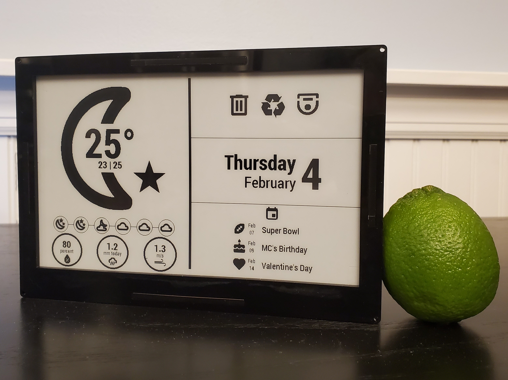

# Ambient E-Ink Display

## Overview
ESPHome project using an e-paper display to show information meant for quick glances.

## Hardware
- [Waveshare 7.5" Epaper Display](https://www.waveshare.com/product/displays/e-paper/epaper-1/7.5inch-e-paper-hat.htm)
- [Adafruit HUZZAH32](https://www.adafruit.com/product/3405)
- [Adafruit TPL5111](https://www.adafruit.com/product/3573)
- [Adafruit 2500mah LiPo Battery](https://www.adafruit.com/product/328)

## Details
This is a Home Assistant focused display that grabs sensor details from MQTT to optimize speed. An example of the Home Assistant config that this uses can be found [here](https://gist.github.com/owenb321/3a1caad7bbbfdebaf21a7f56c705fa58#file-epaper_sensors-yaml).

MQTT is used to expedite the update interval since the Home Assistant API takes up to a minute to provide new information. MQTT with persist flags allows ESPHome to pull the information immeditately upon waking up without connecting to the HA API first.

The Waveshare display consumes power during the ESP32 deep sleep so the TPL5111 timer is used to cut power between update intervals to maximize battery life. Battery life with a 2500mah LiPo has been about 3 months in real world usage.

The case is laser cut and can be screwed shut or just held together with the slot/tab design. SVG files for cutting are found in the [case directory](case)