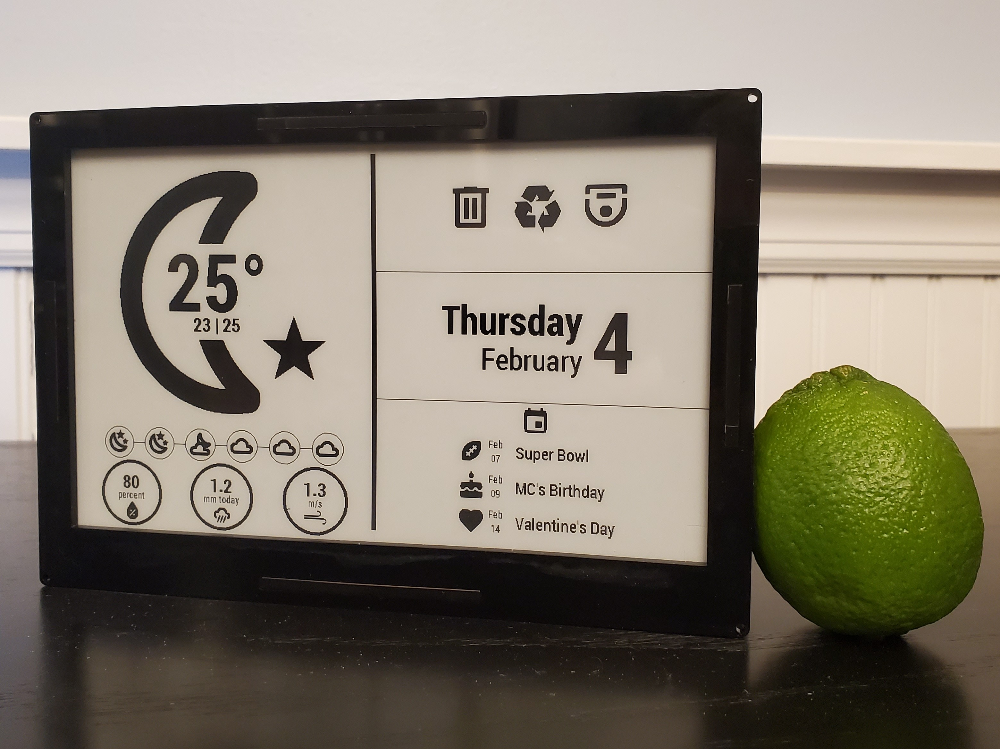

# Ambient E-Ink Display

## Overview
ESPHome project using an e-paper display to show information meant for quick glances.

## Hardware
- [Waveshare 7.5" Epaper Display](https://www.waveshare.com/product/displays/e-paper/epaper-1/7.5inch-e-paper-hat.htm)
- [Adafruit HUZZAH32](https://www.adafruit.com/product/3405)
- [Adafruit TPL5111](https://www.adafruit.com/product/3573)
- [Adafruit 2500mah LiPo Battery](https://www.adafruit.com/product/328)

## Details
This is a Home Assistant focused display that fetches sensor data via the Home Assistant REST API on each wake cycle.

On boot, the device makes a single `POST` to the HA `/api/template` endpoint with a Jinja2 template that returns all required sensor values as JSON in one request. This avoids the latency of the native HA API (which requires HA to discover and connect to the device) while still pulling current data directly from HA.

The Waveshare display consumes power during the ESP32 deep sleep so the TPL5111 timer is used to cut power between update intervals to maximize battery life. Battery life with a 2500mah LiPo has been about 3 months in real world usage.

## Configuration
Copy `secrets.yaml.example` to `secrets.yaml` and fill in your values:
- `wifi_ssid` / `wifi_password` — wireless network credentials
- `ha_base_url` — Home Assistant base URL (e.g. `http://192.168.1.1:8123`)
- `ha_token` — Home Assistant long-lived access token (`Bearer eyJ...`), generated under Profile → Security → Long-Lived Access Tokens

The case is laser cut and can be screwed shut or just held together with the slot/tab design. SVG files for cutting are found in the [case directory](case)